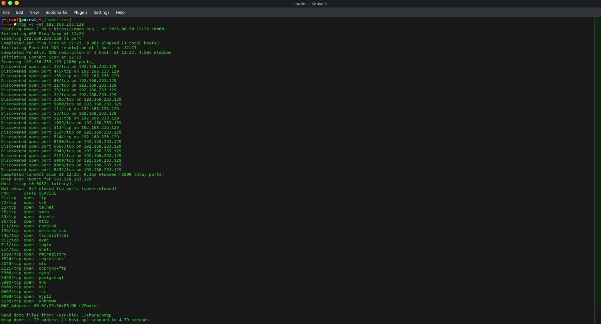
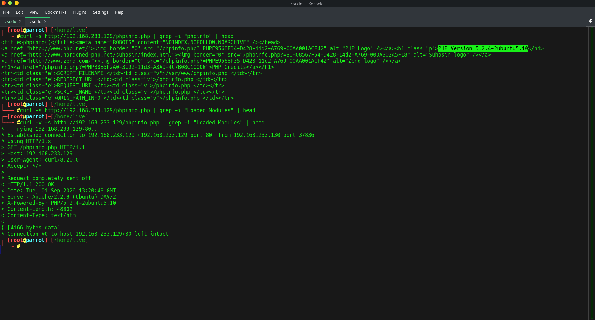
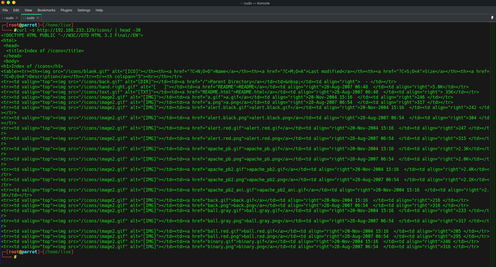
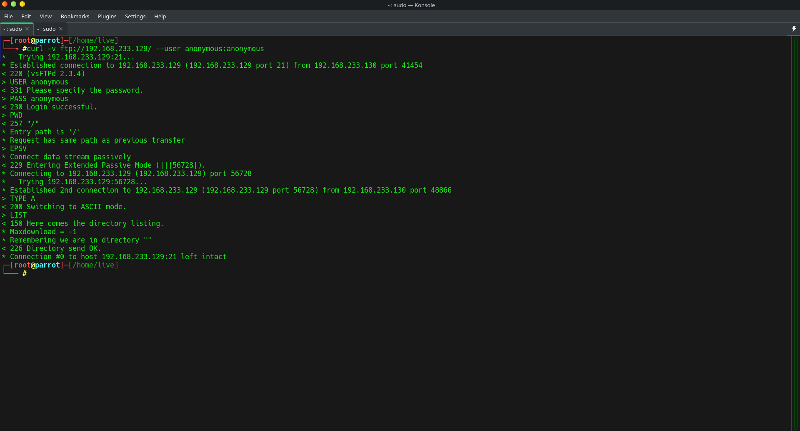
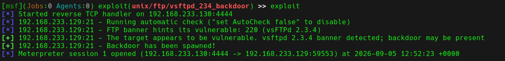
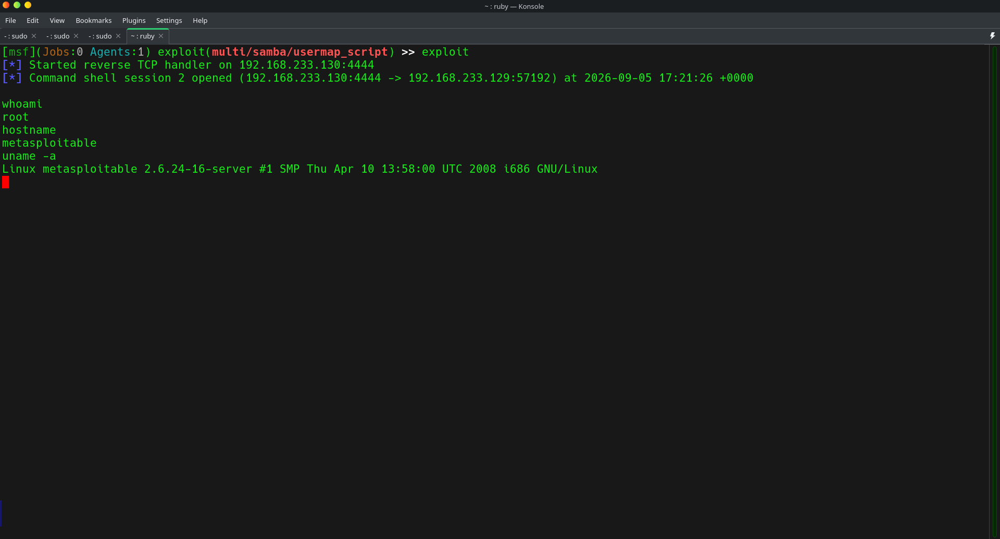
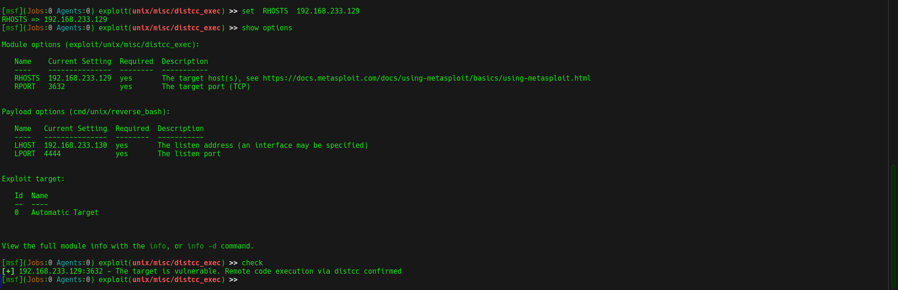
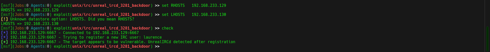

# Metasploitable 2 Penetration Testing Assessment

## 📌 Project Overview

An authorized penetration testing assessment performed against an
intentionally vulnerable Metasploitable 2 virtual machine in an
isolated VMware laboratory environment.

The objective was to identify exposed services, enumerate applications,
validate vulnerabilities, perform controlled exploitation where
appropriate, verify obtained access, and document remediation.

## 🖥️ Lab Environment

| Component | Details |
|---|---|
| Target | Metasploitable 2 |
| Target IP | 192.168.233.129 |
| Attacker | Parrot Security OS |
| Attacker IP | 192.168.233.130 |
| Environment | Isolated VMware Lab |

## 🛠️ Tools Used

- Nmap
- Metasploit Framework
- curl
- FTP
- SMB/Samba

## 🔎 Methodology

Reconnaissance → Enumeration → Vulnerability Identification →
Validation → Controlled Exploitation → Verification → Remediation

## 🚨 Key Findings

| ID | Finding | Severity | Result |
|---|---|---|---|
| F-01 | VSFTPD 2.3.4 Backdoor | Critical | Successfully exploited |
| F-02 | Samba Remote Code Execution | Critical | Successfully exploited |
| F-03 | distcc Remote Code Execution | High | Vulnerability validated |
| F-04 | UnrealIRCd Backdoor | High | Vulnerability validated |
| F-05 | PHP Information Disclosure | Medium | Confirmed |
| F-06 | Directory Listing Enabled | Medium | Confirmed |
| F-07 | Anonymous FTP Access | Medium | Confirmed |

## 💥 Exploitation Highlights

### VSFTPD 2.3.4

The VSFTPD 2.3.4 backdoor was successfully exploited in the
authorized laboratory environment, resulting in a Meterpreter
session and root-level access.

### Samba

The vulnerable Samba service was successfully exploited and
command-line access was verified.

### Vulnerability Validation

distcc and UnrealIRCd were validated as vulnerable.

No successful exploitation is claimed for UnrealIRCd because
the exploitation attempt did not result in a session.

## 📸 Evidence

### Network Enumeration

  

### Web Enumeration

  

### PHP Information Disclosure

  

### Directory Listing

  

### Anonymous FTP

  

### VSFTPD Exploitation

  

### Samba Exploitation

  

### distcc Validation

  

### UnrealIRCd Validation

  

## 📄 Full Assessment Report

[View the Complete Penetration Testing Assessment](./Metasploitable2_Penetration_Testing_Assessment.pdf)

## 🎯 Skills Demonstrated

- Network reconnaissance
- Port and service enumeration
- Web enumeration
- Vulnerability identification
- Vulnerability validation
- Metasploit exploitation
- Post-exploitation verification
- Privilege verification
- Evidence collection
- Risk assessment
- Remediation recommendations

## ⚠️ Disclaimer

This assessment was conducted only against an intentionally vulnerable
system in an isolated and authorized laboratory environment for
educational and portfolio purposes.
